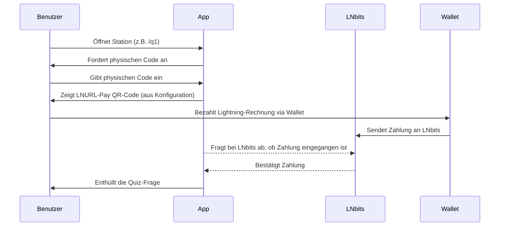

# ⚡ LNHunt

**Eine interaktive Bitcoin Lightning-Erfahrung für Bildung, Events und Communities**

---

## ✨ Überblick

**LNHunt** ist eine spielifizierte Lern-App, aufgebaut auf dem Vercel Fullstack (Next.js + Serverless). Sie ermöglicht Nutzern, Bitcoin und Lightning durch eine standortbasierte oder digitale Schnitzeljagd zu erkunden. Jede Quiz-Station wird durch eine Lightning-Zahlung mittels LNURL-Pay freigeschaltet.

Richtige Antworten enthüllen Schlüsselwörter. Zusammengesetzt bilden diese einen vordefinierten Satz oder eine Phrase – oft aus der Bitcoin-Geschichte entnommen, aber vollständig anpassbar.

---

## 🎯 Lernziele

- Praktische Interaktion mit dem Lightning-Netzwerk (QR-Codes, LNURL, Gebühren, Wallets)
- Verstärkung wichtiger Konzepte (z.B. Zeitpräferenz, Geldgeschichte, Protokoll-Design)
- Physische Aktivierung und Teamarbeit
- Spielerischer Wissenstransfer mit emotionaler Verankerung
- **Fördert Erkundung und reale Interaktion, indem Spieler physische Codes an realen Orten finden müssen.**

---

## 🧠 Spielmechanik

- Mehrere Quiz-Stationen, jede mit einer einzigartigen Frage
- Zweistufiger Zugriffsprozess:
  1. Eingabe des korrekten physischen Codes (gefunden in der realen Welt)
  2. Abschluss der Lightning-Zahlung zur Freischaltung der Frage
- **Physische Codes (code_physical) sind in der realen Welt verteilt (z.B. als QR-Codes, Aufkleber oder Hinweise an bestimmten Orten). Spieler müssen diese finden, um jede Frage freizuschalten.**
- **Nach richtiger Beantwortung erhält man einen digitalen Code (code_digital) als Lösungswort für den finalen Satz.**
- Konfigurierbare Zugriffsmodi:
  - *Niedrige Gebühr*: Multiple-Choice mit Feedback
  - *Premium*: Sofortiger Zugriff auf die richtige Antwort
- Korrekte Antworten schalten jeweils ein Wort (oder Element) frei
- **Gelöste Fragen zeigen ein Vollbild-Badge und ein Häkchen an.**
- **Fortschrittsanzeige und Geheimphrase werden nur angezeigt, wenn mindestens eine Frage gelöst wurde.**
- Ziel: Alle Elemente sammeln und eine finale Nachricht rekonstruieren

---

## 🛠️ Technologie-Stack

| Ebene       | Technologie               | Zweck                                |
|-------------|---------------------------|------------------------------------- |
| Framework   | Next.js (Vercel)          | SSR, Routing, API-Endpunkte          |
| Styling     | Tailwind CSS              | Responsive Mobile-First UI           |
| UI          | Radix UI                  | Barrierefreie Komponenten            |
| Animationen | Framer Motion             | Flüssige Übergänge & Effekte         |
| Hosting     | Vercel                    | Skalierbare Bereitstellung           |
| Zahlungen   | LNbits + LNURL-Pay        | Lightning-native Zahlungen           |
| API         | Next.js API-Routen        | Handhabt LNbits-Polling & Logik      |
| Daten       | Lokales/dynamisches JSON  | Quiz-Inhalte & Logik                 |
| State-Mgmt  | LocalStorage              | Fortschrittsverfolgung pro Gerät     |
| **Audio**   | MP3, HTML5 Audio          | **Erfolgs-/Fehlersounds, Easteregg** |

---

## ⚙️ Funktionsweise (Vereinfacht)



Jede Frage ist sowohl durch einen physischen Code als auch eine Lightning-Zahlung gesichert. Sobald beide abgeschlossen sind, wird die Frage enthüllt. Die korrekte Beantwortung schaltet einen "digitalen Code" für die finale Nachricht frei.
**Gelöste Fragen zeigen ihr Bild als Badge auf dem Startbildschirm an.**

---

## 🧩 Beispiele für Wissensbereiche

- Bitcoin-Grundlagen und Wirtschaftsgeschichte
- Cantillon-Effekt
- Zeitpräferenz
- Protokoll-Konzepte (z.B. Static Channel Backups, Submarine Swaps)
- Wichtige historische Ereignisse und Persönlichkeiten (z.B. Nixon-Schock 1971, Silk Road)

Alle Fragen und Antworten sind vollständig über JSON anpassbar.
**Jede Frage kann ein Bild haben ("image": "q1.png"), das im Fragebildschirm und als Badge angezeigt wird.**
**Hinweise werden nur im Fragebildschirm angezeigt (mit Toggle-Button), nicht auf der Startseite.**

---

## ✅ Vorteile

- Vollständig als White-Label nutzbar und wiederverwendbar
- Unterstützt Bildungs-, Teambuilding- und Onboarding-Anwendungsfälle
- Läuft auf Bitcoin-nativer Infrastruktur (LNURL, LNbits, nicht-kustodial)
- Verbindet Bewegung, Zusammenarbeit und Lernen
- Moderne, barrierefreie UI mit flüssigen Animationen
- Zweifaktor-Zugang (Wissen + Zahlung) für erhöhtes Engagement
- **Alle statischen Assets (Bilder, Audio) werden im public-Ordner versioniert.**
- **Copyright-Hinweis im Footer mit dem aktuellen Jahr.**
- **Responsive, barrierefreie UI.**

---

## 🔧 LNbits-Einrichtung (Grundlegend)

Um es einfach zu halten, verwende [LNbits](https://legend.lnbits.com) als Lightning-Backend:

1. **Erstelle eine Wallet** auf LNbits (kein Node erforderlich)
2. Aktiviere das **LNURLp-Plugin** unter Erweiterungen
3. Für jede Frage (`/q1`, `/q2`, usw.):
   - Erstelle einen LNURL-Pay-Link über das Plugin
   - Verwende einen festen Betrag (z.B. 100 Sats)
   - Setze `description` auf die Fragen-ID (z.B. `"q1"`)
4. Kopiere die **LNURL** und füge sie in deine `questions.json`-Konfiguration ein:

```json
{
  "id": "q1",
  "question": "Wie hoch ist der Block-Subsidy nach dem nächsten Halving?",
  "options": [
    "1,25 BTC",
    "1,5625 BTC",
    "1,75 BTC"
  ],
  "correct_index": 1,
  "code_digital": "fix",
  "code_physical": "magic",
  "hint": "Der Block-Subsidy halbiert sich alle 210.000 Blöcke.",
  "image": "q1.png"
}
```

5. Das Frontend zeigt diese LNURL als QR-Code an.
6. Das Backend fragt bei LNbits ab, ob die Zahlung eingegangen ist.
7. Nach Bestätigung wird die Frage für den Benutzer sichtbar.
**Nachdem alle Fragen gelöst wurden, erscheint oben ein prominenter Button 'LNHunt abschließen & Sats geschenkt bekommen!'.**
**Die finale LNURL wird als QR-Code und direkter Link angezeigt. Der Name des Teilnehmers sollte im Kommentarfeld der Wallet eingetragen werden. Nach erfolgreicher Abhebung leitet die Erfolgs-URL zu `/thnx` weiter.**

Keine dynamische Rechnungserstellung. Kein Node. Keine Komplexität. Einfach funktionierend.

---

## 📦 Optionale Funktionen

- Admin-Dashboard für Fragenkontrolle und Zahlungsprotokolle
- Teambasierte Punktezählung, Timer und Bestenlisten
- Badge-System und Export von Teilnahmenachweisen (PDF/NFT)
- Adaptive Fragenpfade oder Verzweigungslogik
- **Audio-Feedback nach jeder Antwort (Erfolg/Fehler).**
- **Easteregg: Im Info-Panel können die Sounds über Buttons abgespielt werden.**
- **Debug-Panel und Info-Panel können per Button umgeschaltet werden. Das Info-Panel enthält technische Details und Easteregg-Sound-Buttons.**
- **Nach der Withdrawal-Transaktion via LNURL werden Benutzer zu einer /thnx-Seite ('Danke für die Teilnahme') weitergeleitet.**

## 🔄 Technische Details zur Zahlungsüberwachung

### Polling-System
- Adaptives Polling-Intervall:
  - Start: 8 Sekunden Initialverzögerung
  - Schrittweise Erhöhung bis maximal 30 Sekunden
  - Automatische Bereinigung durch Cleanup-Funktionen

### Rate-Limiting
- Zweistufiges System:
  1. IP-basiert: 30 Anfragen pro Minute (15 im Entwicklungsmodus)
  2. Payment-Hash-basiert: ~1/3 des IP-Limits pro Zahlung
- Automatische Anpassung bei Überlastung:
  - 429 Status-Code mit Retry-After Header
  - Exponentielles Backoff bei Fehlern

### Parallele Nutzung
- Optimiert für gleichzeitige Benutzer:
  - Unabhängige Rate-Limits pro Benutzer/Hash
  - Zustandslose API-Endpoints
  - Regelmäßige Cache-Bereinigung (1% pro Request)
- Performance bleibt auch bei hoher Last stabil

### Sicherheit & Fehlerbehandlung
- Validierung aller Payment-Hashes
- Schutz vor Race-Conditions
- Ausführliches Error-Logging
- Entwicklungsmodus mit Mock-Daten

---

## 🧪 Lokale Einrichtung

```bash
git clone https://github.com/muraschal/lnhunt.git
cd lnhunt
npm install
cp .env.example .env.local
# Füge LNbits API-Key und Basis-URL hinzu
npm run dev
```

---

## 🚀 Deployment

1. Pushe das Projekt zu GitHub
2. Verbinde es mit [Vercel](https://vercel.com/)
3. Füge Umgebungsvariablen (API-Keys, Basis-URLs) im Vercel-Dashboard hinzu:
   - `LNBITS_API_URL`: Die API-URL deiner LNbits-Instanz
   - `LNBITS_API_KEY`: Dein LNbits API-Key
   - `LNBITS_WALLET_ID`: Deine LNbits Wallet-ID
   - `LNBITS_LNURL`: Der LNURL-Withdraw-Link für die finale Belohnung
4. Deploye und starte das Spiel – keine Backend-Einrichtung erforderlich

---

## 🐙 GitHub & 🚀 Vercel Deployment

1. Initialisiere ein Git-Repository (falls noch nicht geschehen):
   ```bash
git init
git add .
git commit -m "Initial commit"
   ```
2. Erstelle ein neues Repository auf GitHub und pushe dein Projekt:
   ```bash
git remote add origin https://github.com/DEIN_USERNAME/DEIN_REPO.git
git push -u origin main
   ```
3. Gehe zu [vercel.com](https://vercel.com), importiere dein GitHub-Repo und setze die Umgebungsvariablen (siehe .env.example).
4. Deploye das Projekt – fertig!

---

## 🛠️ Für Entwickler

### Systemanforderungen
- Node.js 16.x oder höher
- NPM 7.x oder höher
- Moderne Browser (Chrome, Firefox, Safari, Edge)

### Entwicklungsmodus
Die Anwendung besitzt einen eingebauten Entwicklungsmodus, der aktiviert wird, wenn keine LNbits-API-Schlüssel konfiguriert sind. In diesem Modus werden Lightning-Zahlungen simuliert, sodass keine echten Sats verwendet werden müssen.

### Sicherheitshinweise
- Speichere niemals sensitive Daten wie API-Schlüssel im Git-Repository
- Die `.env.local` Datei ist in `.gitignore` eingetragen und sollte NIEMALS eingecheckt werden
- Die Anwendung implementiert Rate-Limiting für API-Anfragen zur Verhinderung von Missbrauch

### Fehlerbehandlung
Häufige Probleme:
- **API-Fehler**: Überprüfe die API-Schlüssel und URL in deinen Umgebungsvariablen
- **Zahlungsfehler**: Stelle sicher, dass deine LNbits-Instanz korrekt konfiguriert ist
- **Entwicklungsmodus**: Für Tests ohne echte Zahlungen kannst du die API-Schlüssel leer lassen

### Lizenz
Dieses Projekt steht unter der MIT-Lizenz.

---

## 👥 Lizenz & Mitwirkung

Offen für Anpassung, White-Label-Deployments und Community-Nutzung.
Wenn du LNHunt anpasst oder darauf aufbaust, sind Beiträge und Feedback willkommen!

---

## 🚨 Updates & Funktionen (Version 2.0)

- **Vollständig neue UI:**
  - Fragen-Kacheln zeigen nun das jeweilige Bild als Vollbild-Badge nach dem Lösen.
  - Fortschrittsanzeige und Geheimphrase werden nur angezeigt, wenn mindestens eine Frage gelöst wurde.
  - Der Hinweis 'Klicke auf eine Frage...' wird nur angezeigt, wenn noch offene Fragen vorhanden sind.
  - **Neu! Code-Box mit zentrierten Elementen und gold-stilisierten Titeln**
  - **Neu! Optimierte Video-Größen für Desktop und Mobile mit 720px max-width**
  - **Neu! QR-Code mit Glassmorphism-Effekt nach erfolgreicher Beanspruchung**
  - **Neu! Verbesserte Darstellung der Codes in der Progress-Anzeige mit Lightning-Gold-Styling**

- **Dev-Mode Integration:**
  - **Neu! Interaktiver Dev-Mode Toggle mit Slider für einfaches Testen**
  - **Neu! Automatische Aktivierung des Dev-Modes in Entwicklungs- und Preview-Umgebungen**
  - **Neu! Persistenter Dev-Mode Status mit localStorage**
  - **Neu! Audio-Feedback beim Umschalten des Dev-Modes**
  - **Neu! Optische Unterscheidung des aktiven/inaktiven Dev-Modes**

- **Verbesserte Benutzerfreundlichkeit:**
  - **Neu! Automatisches Ausblenden der Anleitung nach der ersten Interaktion**
  - **Neu! Claim-Status-Tracking mit lokalem Speicher zur Vermeidung von Mehrfach-Claims**
  - **Neu! LNHunt-Abschließen-Button ändert sich nach erfolgreicher Beanspruchung**
  - **Neu! LNURL String und Kopierfunktion werden nach Beanspruchung deaktiviert**

- **Fortgeschrittene Komponenten-Kommunikation:**
  - **Neu! Globaler Zustand für den Dev-Mode mit reaktiven Komponenten**
  - **Neu! Verbesserte Synchronisation zwischen Komponenten**
  - **Neu! Reaktives Polling für Status-Updates alle 500ms**

- **Fragen & Antworten:**
  - Alle Fragen und Antworten werden über die `questions.json`-Datei verwaltet.
  - Jede Frage kann ein `image` haben, das im Fragebildschirm und als Badge angezeigt wird.
  - Hinweise werden nur im Fragebildschirm angezeigt (mit Toggle-Button), nicht auf der Startseite.

- **Lightning-Integration:**
  - Dynamische Rechnungserstellung über LNbits API.
  - Nachdem alle Fragen gelöst wurden, erscheint oben ein prominenter Button 'LNHunt abschließen & Sats geschenkt bekommen!'.
  - Integration eines festen LNURL-Withdraw-Links für die finale Belohnung (Spieler erhalten Sats als Belohnung für den Abschluss).
  - Der LNURL-Withdraw-Link wird über die Umgebungsvariable `LNBITS_LNURL` konfiguriert.
  - Hinweis: Der Name des Teilnehmers sollte im Kommentarfeld der Wallet eingetragen werden.

- **Audio-Feedback:**
  - Erfolgs- und Fehlersounds nach jeder Antwort (MP3, kompatibel mit Web/Mobile/Desktop).
  - Easteregg: Im Info-Panel können die Sounds über Buttons abgespielt werden.

- **Abschluss & Dankeschön-Seite:**
  - Nach der Withdrawal-Transaktion via LNURL werden Benutzer zu einer /thnx-Seite ('Danke für die Teilnahme') weitergeleitet.

- **Debug & Info:**
  - Debug-Panel und Info-Panel können per Button umgeschaltet werden.
  - Das Info-Panel enthält technische Details und Easteregg-Sound-Buttons.

- **Best Practices:**
  - Copyright-Hinweis im Footer mit dem aktuellen Jahr.
  - Responsive, barrierefreie UI.
  - Alle statischen Assets (Bilder, Audio) werden im public-Ordner versioniert.
  - **Neu! Performance-Optimierungen für Videos und Animationen**
  - **Neu! Verbesserte Fade-In/Fade-Out Übergänge zwischen Screens**

---

### Beispiel für die neue questions.json

```json
{
  "id": "q1",
  "question": "Wie hoch ist der Block-Subsidy nach dem nächsten Halving?",
  "options": [
    "1,25 BTC",
    "1,5625 BTC",
    "1,75 BTC"
  ],
  "correct_index": 1,
  "code_digital": "fix",
  "code_physical": "magic",
  "hint": "Der Block-Subsidy halbiert sich alle 210.000 Blöcke.",
  "image": "q1.png"
}
```

---

### Dev-Mode Toggle Funktion 

- **Neu! Der Dev-Mode-Toggle erlaubt das Testen der Anwendung ohne echte Lightning-Zahlungen**
- **Neu! Im aktiven Dev-Mode werden:**
  - **Passwörter automatisch ausgefüllt**
  - **Mock-Rechnungen generiert** 
  - **Zahlungen automatisch simuliert**
- **Neu! Der Dev-Mode ist über einen Slider-Toggle direkt in der UI zugänglich**
- **Neu! Der Toggle-Zustand wird persistent gespeichert und zwischen Sitzungen beibehalten**

---

### Hinweise zur LNURL-Withdrawal-Belohnung

- Die finale LNURL-Withdraw wird als QR-Code und direkter Link angezeigt, sobald alle Fragen gelöst wurden.
- Die LNURL wird in der Umgebungsvariable `LNBITS_LNURL` konfiguriert.
- Der Name des Teilnehmers sollte im Kommentarfeld der Wallet eingetragen werden.
- Spieler erhalten Sats als Belohnung für das Lösen aller Fragen.
- Nach erfolgreicher Abhebung leitet die Erfolgs-URL zu `/thnx` weiter.
- **Neu! Verbesserter QR-Code mit weißem Hintergrund für bessere Scanbarkeit**
- **Neu! Deaktivierung von QR-Code und Copy-Funktion nach erfolgreicher Beanspruchung**
- **Neu! Glassmorphism-Effekt über dem QR-Code nach erfolgreicher Beanspruchung**

---

**Tipp:**
Du kannst Fragen, Bilder und Sounds frei anpassen – alles wird über JSON und den public-Ordner gesteuert!

## CI/CD-Workflow

Dieses Projekt verwendet einen automatisierten CI/CD-Workflow mit GitHub und Vercel. Details zur Pipeline findest du in [DEPLOYMENT.md](./DEPLOYMENT.md).

- **Produktion:** https://lnhunt.rapold.io
- **Feature-Previews:** https://pr-[nummer].lnhunt.rapold.io

---

## Changelog Version 2.0

### UI-Verbesserungen
- Zentrale Ausrichtung aller Code-Box-Elemente
- Gold-Stile für Titel und Code-Elemente
- Optimierte Video-Größen (720px max-width, 60vh max-height)
- QR-Code mit weißem Hintergrund und Padding
- Verbessertes LNURL-Claim-Feedback mit Glassmorphism

### Dev-Mode
- Interaktiver Toggle mit Slider und Sound-Feedback
- Globaler Dev-Mode-Status mit reaktivem State-Management
- Automatische Initialisierung basierend auf Umgebung (localhost/preview)
- Persistenter Status mit localStorage

### UX-Optimierungen
- Automatisches Ausblenden der Anleitung nach erster Interaktion
- Verbessertes Claim-Status-Tracking (idle, processing, claimed, failed)
- Änderung des LNHunt-Abschließen-Buttons nach Beanspruchung
- Deaktivierung von QR-Code und Copy-Funktion nach Beanspruchung

### Komponentenkommunikation
- Verbesserter Datenfluss zwischen Komponenten
- Reaktives Polling für Status-Updates
- Globaler Entwicklungsmodus-State für konsistentes Verhalten
