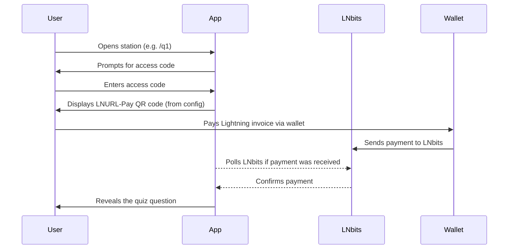

# ⚡ lnhunt

**An Interactive Bitcoin Lightning Experience for Education, Events, and Communities**

---

## ✨ Overview

**lnhunt** is a gamified learning app built on the Vercel Fullstack (Next.js + Serverless). It enables users to explore Bitcoin and Lightning through a location-based or digital scavenger hunt. Each quiz station is unlocked via a Lightning payment using LNURL-Pay.

Correct answers reveal keywords. When combined, these form a predefined sentence or phrase – often drawn from Bitcoin history, but fully customizable.

---

## 🎯 Learning Goals

- Real-world interaction with the Lightning Network (QR codes, LNURL, fees, wallets)
- Reinforcement of key concepts (e.g. time preference, money history, protocol design)
- Physical activation and team collaboration
- Gamified knowledge transfer with emotional anchoring

---

## 🧠 Game Mechanics

- Multiple quiz stations, each with a unique question
- Two-step access process:
  1. Enter the correct access code (related to Bitcoin terminology)
  2. Complete the Lightning payment to unlock the question
- Configurable access modes:
  - *Low-fee*: Multiple Choice with feedback
  - *Premium*: Instant access to the correct answer
- Correct answers unlock one word (or element) each
- Goal: Collect all elements and reconstruct a final message

---

## 🛠️ Tech Stack

| Layer        | Tech                       | Purpose                            |
|-------------|----------------------------|------------------------------------|
| Framework   | Next.js (Vercel)           | SSR, routing, API endpoints        |
| Styling     | Tailwind CSS               | Responsive mobile-first UI         |
| UI          | Radix UI                   | Accessible components              |
| Animations  | Framer Motion              | Smooth transitions & effects       |
| Hosting     | Vercel                     | Scalable deployment                |
| Payments    | LNbits + LNURL-Pay         | Lightning-native payments          |
| API         | Next.js API Routes         | Handles LNbits polling & logic     |
| Data        | Local/dynamic JSON         | Quiz content & logic               |
| State Mgmt  | LocalStorage               | Progress tracking per device       |

---

## ⚙️ How It Works (Simplified)



Each question is locked behind both an access code and a Lightning payment. Once both are completed, the question is revealed. Answering it correctly unlocks a "solution word" for the final message.

---

## 🧩 Sample Knowledge Areas

- Bitcoin fundamentals and economic history  
- Cantillon Effect  
- Time Preference  
- Protocol concepts (e.g. Static Channel Backups, Submarine Swaps)  
- Key historic events and personalities (e.g. 1971 Nixon shock, Silk Road)

All questions and answers are fully customizable via JSON.

---

## ✅ Benefits

- Fully whitelabel and reusable  
- Supports educational, team-building, and onboarding use cases  
- Runs on Bitcoin-native infrastructure (LNURL, LNbits, non-custodial)  
- Blends movement, collaboration, and learning  
- Modern, accessible UI with smooth animations
- Two-factor access (knowledge + payment) for enhanced engagement

---

## 🔧 LNbits Setup (Basic)

To keep things simple, use [LNbits](https://legend.lnbits.com) as your Lightning backend:

1. **Create a Wallet** on LNbits (no node required)
2. Enable the **LNURLp plugin** under Extensions
3. For each question (`/q1`, `/q2`, etc.):
   - Create one LNURL-Pay link via the plugin
   - Use a fixed amount (e.g. 100 sats)
   - Set `description` to the question ID (e.g. `"q1"`)
4. Copy the **LNURL** and insert it into your `questions.json` config:

```json
{
  "id": "q1",
  "question": "What is the Cantillon Effect?",
  "lnurl": "lnurl1dp68gurn8ghj7mrv9...",
  "options": [...],
  "correct_index": 0,
  "answer_key": "Cantillon",
  "access_code": "magic",
  "hint": "A hint about the access code"
}
```

5. The frontend displays this LNURL as a QR code.
6. The backend polls LNbits to check if the payment has been received.
7. Once confirmed, the question becomes visible to the user.

No dynamic invoice creation. No node. No complexity. Just working.

---

## 📦 Optional Features

- Admin dashboard for question control and payment logs  
- Team-based scoring, timers, and leaderboards  
- Badge system and proof-of-participation export (PDF/NFT)  
- Adaptive question paths or branching logic  

---

## 🧪 Local Setup

```bash
git clone https://github.com/muraschal/lnhunt.git
cd lnhunt
npm install
cp .env.example .env.local
# Add LNbits API Key and base URL
npm run dev
```

---

## 🚀 Deployment

1. Push the project to GitHub  
2. Connect it to [Vercel](https://vercel.com/)  
3. Add environment variables (API keys, base URLs) in the Vercel dashboard  
4. Deploy and start playing – no backend setup required

---

## 🐙 GitHub & 🚀 Vercel Deployment

1. Initialisiere ein Git-Repository (falls noch nicht geschehen):
   ```bash
git init
git add .
git commit -m "Initial commit"
   ```
2. Erstelle ein neues Repository auf GitHub und pushe dein Projekt:
   ```bash
git remote add origin https://github.com/DEIN_USERNAME/DEIN_REPO.git
git push -u origin main
   ```
3. Gehe zu [vercel.com](https://vercel.com), importiere dein GitHub-Repo und setze die Umgebungsvariablen (siehe .env.example).
4. Deploye das Projekt – fertig!

---

## 👥 License & Contribution

Open for customization, whitelabel deployments, and community use.  
If you adapt or build on top of lnhunt, contributions and feedback are welcome!
